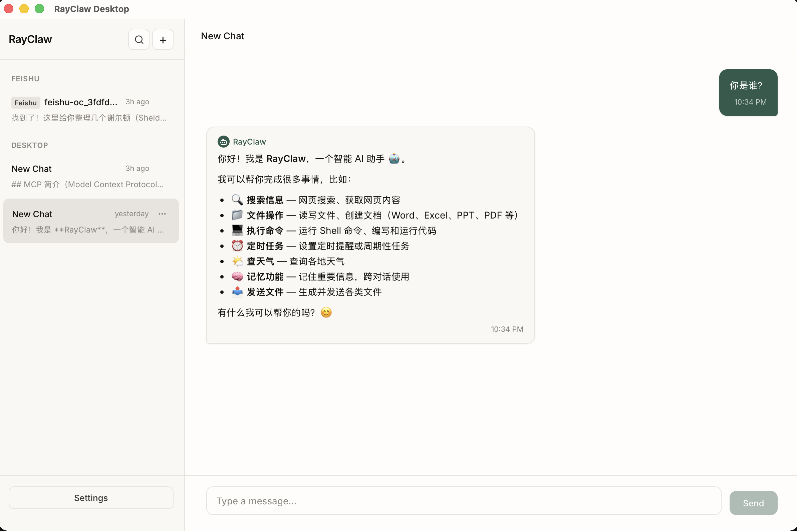
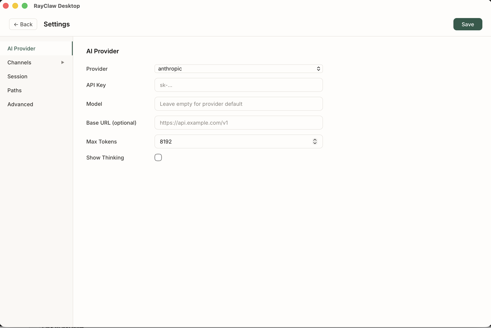
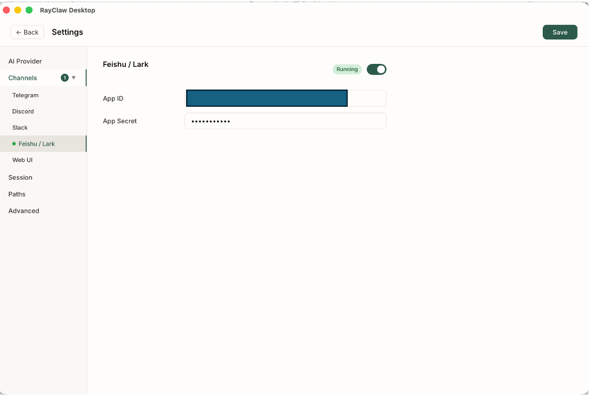

# RayClaw Desktop

[English](README.md) | [中文](README_CN.md)

[](LICENSE)
[](https://tauri.app)
[](https://crates.io/crates/rayclaw)

RayClaw Desktop is a native Tauri client for the RayClaw agent runtime. It runs the full Rust agent locally, exposes streaming tool execution in the desktop UI, and gives you a control surface for chats, skills, memory, channels, schedules, and usage data.

This desktop build also bundles newer local automation capabilities, including browser automation, desktop screenshots, and Windows desktop control tools.

## Features

- Full local RayClaw runtime inside a native desktop app
- Streaming chat with live tool-step visualization
- Multi-chat sidebar with pinning, rename, search, export, and delete
- Image attachments in desktop chats
- Global and per-chat `SOUL.md` personality editing
- Built-in settings pages for provider config, channels, skills, memory, usage, and scheduled tasks
- Optional bridge to Telegram, Discord, Slack, and Feishu/Lark
- Bundled `agent-browser` runtime for browser automation in dev and packaged builds

## Screenshots

| Chat | Settings | Channels |
| :-: | :-: | :-: |
|  |  |  |

## New Tools

RayClaw Desktop ships the core RayClaw tool stack plus several newer desktop-focused tools.

### Browser and desktop automation

| Tool | Description |
|------|-------------|
| `browser` | Runs `agent-browser` commands for persistent browser automation. Supports navigation, snapshots, form fill, clicks, tabs, cookies, storage, screenshots, PDF export, waits, JS eval, and more. Browser state is kept per chat. |
| `capture_screenshot` | Captures the current desktop to PNG and returns the saved path. Useful for vision-based inspection outside the browser tool. |
| `list_windows` | Lists visible top-level desktop windows with handles, titles, process ids, bounds, and foreground state. |
| `focus_window` | Brings a desktop window to the foreground by handle or title match. |
| `click` | Clicks on desktop coordinates. Supports direct screen coordinates, window-relative coordinates, and screenshot-relative coordinates. |
| `type_text` | Types text into the currently focused desktop window. |
| `press_key` | Sends key presses or key combinations such as `Enter`, `Tab`, `Ctrl+L`, or `Shift+Tab`. |
| `scroll` | Scrolls the desktop mouse wheel, optionally after moving to a target point. |
| `find_text` | Uses Windows UI Automation to locate visible text and returns clickable coordinates, with screenshot fallback guidance when no match is found. |

Notes:
- `browser` works cross-platform when the `agent-browser` runtime is available.
- `capture_screenshot` works on Windows, macOS, and Linux, using the native platform command path.
- `list_windows`, `focus_window`, `click`, `type_text`, `press_key`, `scroll`, and `find_text` are currently Windows-only.

### Core agent tools

| Tool group | Description |
|------------|-------------|
| File tools | `read_file`, `write_file`, `edit_file`, `glob`, `grep` for local project inspection and editing. |
| Shell | `bash` for command execution inside the configured working directory. |
| Web | `web_search` and `web_fetch` for search and page retrieval. |
| Memory | `read_memory`, `write_memory`, `structured_memory_search`, `structured_memory_update`, `structured_memory_delete`. |
| Planning | `todo_read` and `todo_write` for plan-and-execute flows. |
| Skills | `activate_skill` and `sync_skills` for skill activation and syncing. |
| Messaging and export | `send_message` and `export_chat` for cross-chat messaging and markdown exports. |
| Scheduling | `schedule_task`, `list_scheduled_tasks`, `pause_scheduled_task`, `resume_scheduled_task`, `cancel_scheduled_task`, `get_task_history`. |
| Delegation | `sub_agent` for restricted sub-task execution. |

If ACP or MCP is configured in the RayClaw data directory, additional external-agent or MCP server tools can also appear at runtime.

## Prerequisites

- Node.js 18+ and `pnpm`
- Rust toolchain
- Platform requirements for Tauri:
  - Windows: WebView2
  - macOS: Xcode Command Line Tools
  - Linux: WebKitGTK and GTK3 development packages
- A configured LLM provider for RayClaw

## Quick Start

```bash
git clone https://github.com/rayclaw/rayclaw-desktop.git
cd rayclaw-desktop
pnpm install
pnpm tauri dev
```

`pnpm tauri dev` automatically prepares the bundled `agent-browser` runtime before starting the app.

## Build

```bash
pnpm tauri build
```

The build step also prepares the bundled browser runtime and produces the native installer/app bundle for your platform.

## Desktop Data Layout

By default the desktop app uses the RayClaw home directory under `~/.rayclaw`:

```text
~/.rayclaw/
  rayclaw.config.yaml
  data/
    SOUL.md
    skills/
    runtime/
  tmp/
```

Important runtime behavior:

- Desktop chats are writable inside the app.
- Chats synced from Telegram, Discord, Slack, or Feishu/Lark are visible in the desktop UI and treated as read-only there.
- Channel processes can be enabled or disabled from the desktop settings page.

## Project Structure

```text
rayclaw-desktop/
  src/                     React UI
  src-tauri/               Tauri host and Rust desktop commands
  vendor/rayclaw/          Pinned RayClaw runtime source
  browser-runtime/         Bundled agent-browser runtime project
  screenshots/             README assets
```

Key areas:

- `src/components/ChatWindow.tsx`: streaming chat UI, attachments, search, chat-level `SOUL.md`
- `src/components/SettingsPage.tsx`: providers, channels, skills, memory, usage, scheduler
- `src-tauri/src/lib.rs`: app bootstrap, bundled browser runtime setup, channel startup
- `src-tauri/src/commands.rs`: Tauri commands used by the desktop frontend
- `vendor/rayclaw/src/tools/`: built-in tool implementations

## Related Projects

- [RayClaw](https://github.com/rayclaw/rayclaw): the Rust agent runtime used by this desktop app

## License

MIT
